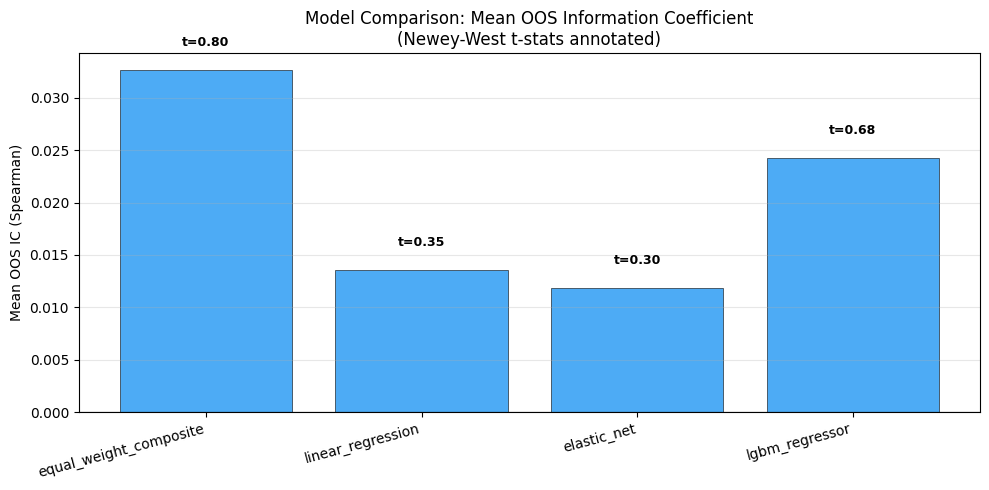
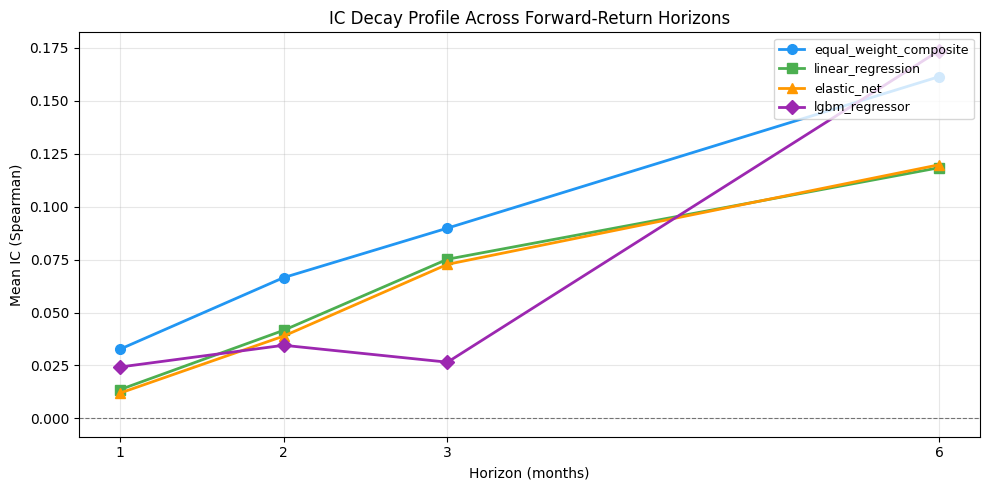
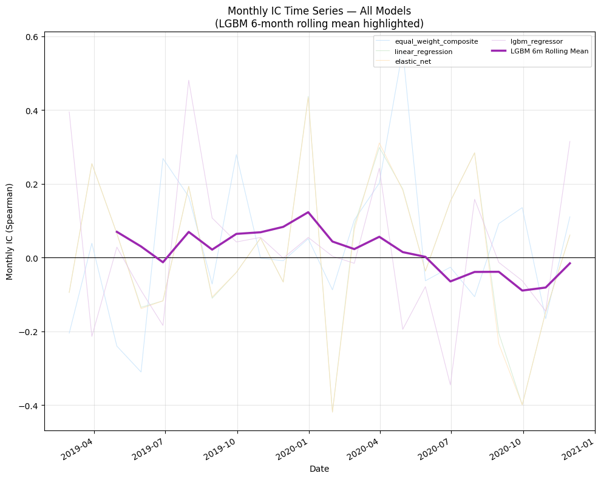
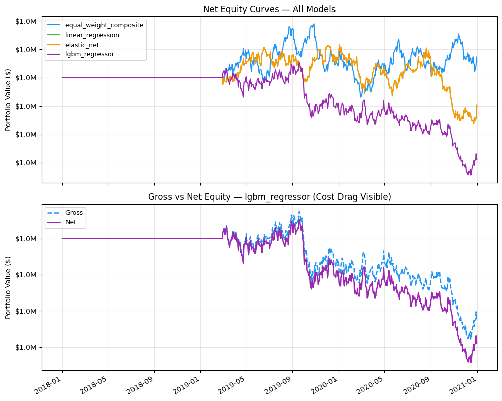
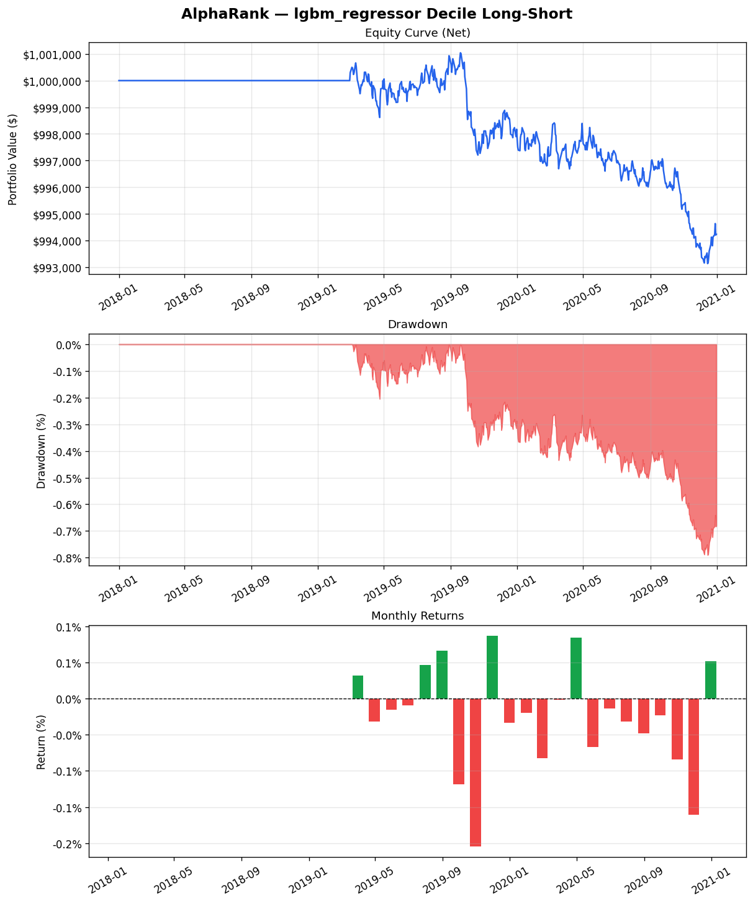

# AlphaRank Pipeline Results

> **Honesty notice:** This is a methodology showcase on **synthetic** data.
> The alpha signal is deliberately planted — see Planted Alpha section below.
> Results are NOT real-world investment performance.


## Model Comparison: OOS IC Statistics

| Model | Mean IC | ICIR | NW t-stat | p-value | N months |
|-------|---------|------|-----------|---------|----------|
| equal_weight_composite | 0.0326 | 0.165 | 0.795 | 0.435 | 22 |
| linear_regression | 0.0135 | 0.062 | 0.349 | 0.730 | 22 |
| elastic_net | 0.0119 | 0.054 | 0.303 | 0.765 | 22 |
| lgbm_regressor | 0.0242 | 0.120 | 0.683 | 0.502 | 22 |

## Backtest Results: Gross vs Net Performance

| Model | Gross Sharpe | Net Sharpe | Sharpe 95% CI | Cost bps | Turnover | Max DD | Trades |
|-------|-------------|-----------|---------------|---------|----------|--------|--------|
| equal_weight_composite | 0.206 | 0.117 | [-0.96, 1.24] | 10.0 | 0.282 | -0.005 | 21 |
| linear_regression | -0.096 | -0.208 | [-1.36, 0.82] | 10.0 | 0.332 | -0.006 | 25 |
| elastic_net | -0.096 | -0.208 | [-1.36, 0.82] | 10.0 | 0.332 | -0.006 | 25 |
| lgbm_regressor | -0.498 | -0.641 | [-1.73, 0.45] | 10.0 | 0.421 | -0.008 | 32 |

## Factor Attribution (LGBM Strategy)

| Metric | Value |
|--------|-------|
| Alpha (monthly) | -0.00032 |
| Alpha t-stat | -1.709 |
| R-squared | 0.175 |
| Beta (momentum) | 0.013 |
| Beta (value) | 0.009 |

## Figures











## Planted Alpha Disclosure

The alpha signal is **deliberately planted** using the formula:

```
alpha = IC_target * sigma_noise / sqrt(1 - IC_target^2)
```

Planted IC targets:
- **Momentum**: IC_target = 0.06
- **Value**: IC_target = 0.04

Unplanted (negative controls, IC_target = 0):
- Reversal, Volatility, Quality, Liquidity

Survivorship and delist handling: OHLCV frames truncated at delist month (no NaN rows). Delist probability: 3% per year.

> The models are *expected* to recover this planted signal. This is a methodology showcase, not a real-alpha claim.
