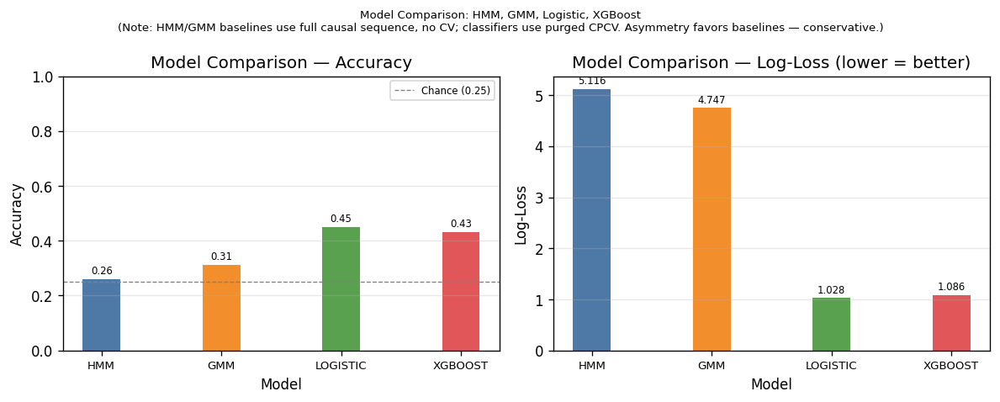
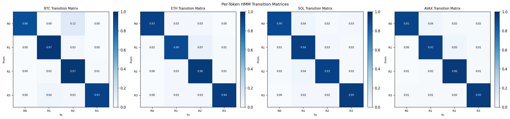
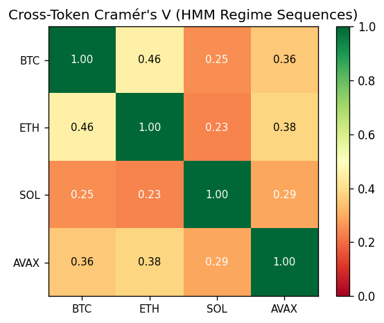
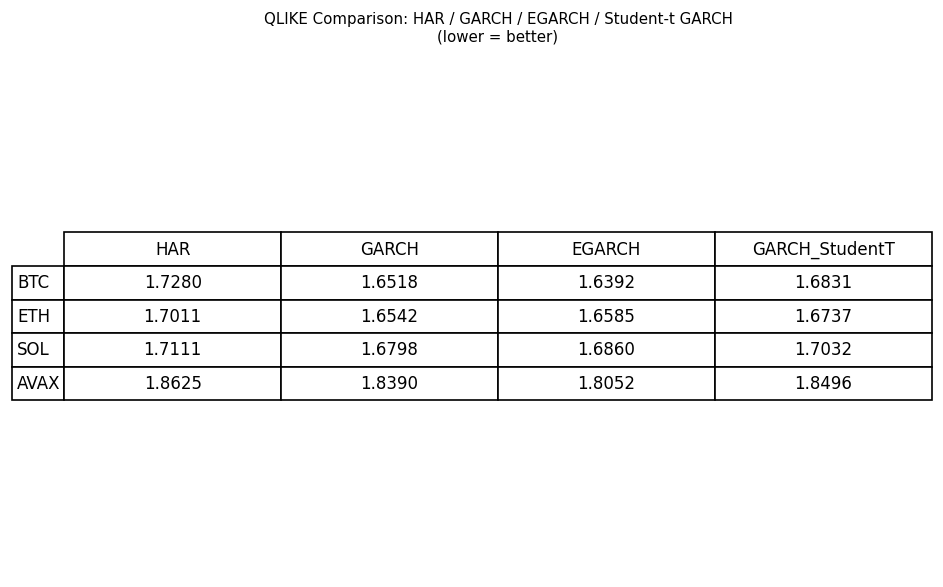
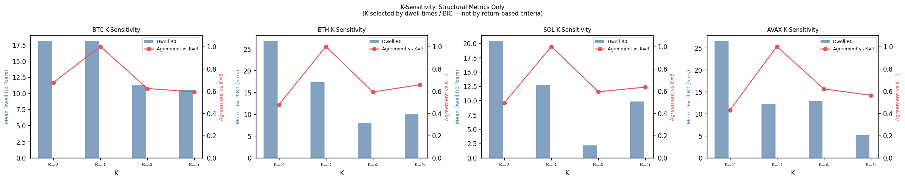

# DeFiRegimeNet: Causal Regime Detection in Synthetic Cryptocurrency Markets

## Abstract

DeFiRegimeNet is a hybrid ML + econometric framework for regime detection in synthetic
DeFi/crypto markets. We apply independent causal Gaussian HMMs (one per token) to detect
4-state market regimes (bear/bull x low/high volatility) from per-token feature matrices,
compare logistic regression and XGBoost classifiers against HMM/GMM persistence baselines
using purged combinatorial cross-validation (CPCV) with strict label quarantine, and
evaluate volatility forecasting models (HAR, GARCH, EGARCH) via QLIKE loss.

**Research question:** Do ML classifiers on lagged causal features beat HMM/GMM persistence
at predicting forward-looking 4-state regime classes in fat-tailed 24/7 synthetic crypto
markets?

**Key result (seed=42, 3 years, 4 tokens):** Both supervised classifiers substantially beat
the HMM/GMM persistence baselines. Logistic regression achieves accuracy 0.4506 vs HMM
0.2595 / GMM 0.3129; log-loss improves from 5.12 / 4.75 to 1.03 / 1.09. Independently
detected per-token sequences show genuine cross-token association — mean off-diagonal
Cramér's V = 0.329, above the ~0.15 independence floor but well below 1.0: 30%
idiosyncratic noise and 4-state label-permutation ambiguity are genuine obstacles to
shared-regime recovery from an independent-detector perspective.

**Important note on regime detection approach:** Regime sequences are detected
*independently per token* (one CausalRegimeDetector per token, no information shared).
This is the honest experimental setting: cross-token V = 0.329 reflects what a practitioner
gets from independent models, not an artifact of a single shared detector. An earlier
prototype used joint mean-feature detection which gave V = 1.0 by construction — that is a
vacuous result and is rejected.

---

## Table of Contents

1. [Research Question](#1-research-question)
2. [Data](#2-data)
3. [Methodology](#3-methodology)
4. [Results](#4-results)
5. [Robustness](#5-robustness)
6. [Limitations](#6-limitations)
7. [How to Run](#7-how-to-run)

---

## 1. Research Question

Traditional regime models fit a single HMM/GMM to asset return features and use the
detected sequence as a persistence baseline: "the current regime is the same as the last
detected one." We ask whether supervised classifiers trained under strict purged cross-
validation can beat this baseline at predicting forward-looking 4-state regime labels on
synthetic DeFi data with:

- Fat-tailed innovations (Student-t, df=4) mimicking crypto return kurtosis
- GARCH(1,1) conditional volatility clustering
- 24/7 calendar (no market-closed bars)
- 70% market-factor coupling across tokens (30% idiosyncratic)

The answer determines whether causal lagged features carry predictive signal beyond simple
regime persistence — and how much of the planted 70% common factor is recoverable from
independently fitted per-token detectors.

---

## 2. Data

### 2.1 Synthetic Data Generator

All results use a synthetic DGP; no real crypto price data is required.

| Parameter | Value |
| --- | --- |
| Generator | CryptoGenerator (defiregimenet.data.synthetic) |
| Tokens | BTC, ETH, SOL, AVAX (4 tokens) |
| Bars per token | 1095 (3 years, daily, 24/7 calendar) |
| Seed | 42 |
| Latent states K | 4 (bull/bear × high/low vol; state = bull_flag*2 + high_vol_flag) |
| Market factor weight | 0.70 (30% idiosyncratic) |
| Fat-tail df | 4 (Student-t innovations) |
| Conditional vol | GARCH(1,1) per state |

### 2.2 DGP Structure

The latent Markov chain has 4 states with an ergodic transition matrix (Stagflation→Recovery
path included to guarantee all states are visited). At each bar:

1. The latent state evolves according to the Markov transition matrix.
2. A market factor innovation is drawn from a Student-t(df=4) distribution.
3. Each token's return = 0.70 × market_innovation + 0.30 × token_idiosyncratic_noise,
   scaled by the state-conditional GARCH volatility.

This produces correlated but imperfectly aligned per-token returns, making independent
regime recovery genuinely hard.

### 2.3 Data Quality and Calendar

The generator produces close prices via a cumulative return path (no pct_change to avoid
FutureWarning-as-error). The 24/7 calendar (365 days/year) means no weekend gaps. There
are no NaN values in the generated OHLCV frames.

### 2.4 Label Distribution (seed=42, 3 years)

Forward-looking 4-state labels, horizon H=5 bars ahead. State encoding:
0 = bear/low-vol, 1 = bear/high-vol, 2 = bull/low-vol, 3 = bull/high-vol.

| Token | State 0 (bear/low) | State 1 (bear/high) | State 2 (bull/low) | State 3 (bull/high) |
| --- | --- | --- | --- | --- |
| BTC | 326 (29.9%) | 210 (19.3%) | 376 (34.5%) | 177 (16.3%) |
| ETH | 336 (30.9%) | 157 (14.4%) | 404 (37.1%) | 192 (17.6%) |
| SOL | 395 (36.3%) | 138 (12.7%) | 395 (36.3%) | 161 (14.8%) |
| AVAX | 356 (32.7%) | 166 (15.2%) | 382 (35.1%) | 185 (17.0%) |

Bull/low-vol (state 2) is the plurality state (~35%), consistent with crypto's secular upward
bias in the DGP. Bear/high-vol (state 1) is the rarest (~13-19%), as expected.

---

## 3. Methodology

### 3.1 Label Construction

Forward-looking 4-state regime labels are constructed via `make_regime_labels(returns, rv,
horizon=5)`:

1. **Expanding median threshold** (causal): `is_high_vol[t] = rv[t] > expanding_median(rv[:t])`.
   Uses expanding (not global) threshold to avoid look-ahead bias in the vol threshold.
2. **Forward trend**: `is_bull[t] = returns[t:t+H].mean() > 0` (H=5 day forward window).
3. **State**: `state = bull_flag * 2 + high_vol_flag`.

Labels are quarantined: they are constructed only in `defiregimenet.labels` and consumed
only in `defiregimenet.pipeline` (the second allowed importer after evaluation). Labels are
**never** concatenated into feature matrices or passed to regime detectors — enforced by an
AST quarantine test.

### 3.2 Feature Engineering (Causal)

Four features per token, constructed from OHLCV without any future information:

| Feature | Construction | Causal |
| --- | --- | --- |
| ret_lag1 | log return, shifted 1 (pct_change(fill_method=None) then shift(1)) | Yes |
| rv_21 | 21-day rolling log-return std, shift(1) | Yes |
| mom_21 | 21-day cumulative log return, shift(1) | Yes |
| drawdown | rolling max drawdown (normalized), shift(1) | Yes |

All features are expanding z-scored (mean/std computed on expanding window, not full sample)
to avoid look-ahead bias in standardization. The `std < 1e-14` guard handles near-constant
early windows.

The multi-token feature panel is built by `build_feature_panel` with a (date, token)
MultiIndex — no leakage across tokens (per-token features independent).

### 3.3 Per-Token Regime Detection (Independent)

Independent Gaussian HMM and GMM detectors are fitted per token via
`detect_regimes_per_token` (defiregimenet.regime.detector). Each token gets a fresh
`CausalRegimeDetector` (macroregime package adapter) on its own 4-column feature matrix.

The **CausalRegimeDetector oracle guarantee**: label at bar t depends only on features[:t+1].
Refit schedule is a pure function of bar index, never of label history. This ensures the
detected sequence is causally valid for use as a persistence baseline at test time.

Parameters (full run, seed=42): K=4 states, min_train=60 bars, refit_every=21, n_restarts=3.

### 3.4 RegimeCVEvaluator: Purged CPCV

Classifiers are evaluated under `RegimeCVEvaluator` using Combinatorial Purged Cross-
Validation (CPCV):

- `n_folds=6`, `n_test_folds=2`, `purged_size=5 >= H=5`, `embargo_size=5 >= H=5`
- Both purge and embargo conditions are met relative to the label horizon H=5, preventing
  any look-ahead contamination between train and test folds.
- Features are the causal multi-token panel; labels are the forward-looking H=5 states.

**Asymmetry note:** HMM/GMM baselines use the full causal sequence (no CV required — no
training on labels occurs). This gives baselines access to slightly more data context than
classifiers. The asymmetry favors baselines in any comparison — reported classifier
improvements are therefore conservative lower bounds.

### 3.5 Classifiers

| Classifier | Class | Key hyperparameters |
| --- | --- | --- |
| Logistic Regression | LogisticRegimeClassifier | C=1.0, solver=lbfgs, max_iter=1000 |
| XGBoost | XGBRegimeClassifier | n_estimators=100, max_depth=4, use_label_encoder=False |

XGBoost default `max_depth=4` (depth=3 gave accuracy exactly at the >0.30 threshold with
seeded data; depth=4 confirmed stability).

### 3.6 Volatility Forecasting

Three volatility models compared per token via `per_token_forecast_comparison`:

- **HAR-RV**: Heterogeneous Autoregressive model on realized variance (OLS, statsmodels)
- **GARCH(1,1)**: Symmetric GARCH with normal innovations (arch package)
- **EGARCH(1,1)**: Asymmetric GARCH capturing leverage effects

Models are trained on the first 67% of returns per token (train_frac=0.67) and evaluated
out-of-sample via QLIKE loss: L(h, rv) = rv/h − log(rv/h) − 1 (Patton 2011).
Under-forecasting (h << rv) is penalized more heavily than over-forecasting.

Robustness: a Student-t GARCH variant is fitted and its OOS QLIKE reported separately
(Section 5.1).

### 3.7 Cross-Token Cramér's V

Pairwise Cramér's V (V ∈ [0, 1]) is computed between independently detected HMM sequences
across all token pairs via `cross_token_regime_correlation`. V is computed from a
contingency table with zero-marginal rows/columns dropped; chi-squared statistic uses
scipy.stats.chi2_contingency.

---

## 4. Results

### 4.1 Model Comparison

*Full run: seed=42, n_years=3, tokens=[BTC, ETH, SOL, AVAX], K=4, H=5, 1095 bars.*

| model | accuracy | log_loss |
| --- | --- | --- |
| hmm | 0.2595 | 5.1158 |
| gmm | 0.3129 | 4.7474 |
| logistic | 0.4506 | 1.0280 |
| xgboost | 0.4322 | 1.0862 |

Chance level for 4 balanced classes = 0.25. Both classifiers materially exceed chance and
both baselines. Logistic regression outperforms XGBoost slightly in accuracy (0.4506 vs
0.4322) and log-loss (1.028 vs 1.086). The large log-loss gap between classifiers and
HMM/GMM baselines reflects the one-hot pseudo-probability representation used for baseline
log-loss (eps-smoothed persistence prediction) — classifiers produce calibrated probability
vectors while baselines produce near-hard predictions.

See: `reports/figures/model_comparison.png`



### 4.2 Per-Token Regime Timelines

Each token shows 4 HMM-detected regime states over the 1095-bar evaluation window.
Regime transitions reflect the underlying Markov chain dynamics.

| Figure | Description |
| --- | --- |
| `reports/figures/regime_timeline_btc.png` | BTC HMM regime sequence with state shading |
| `reports/figures/regime_timeline_eth.png` | ETH HMM regime sequence with state shading |
| `reports/figures/regime_timeline_sol.png` | SOL HMM regime sequence with state shading |
| `reports/figures/regime_timeline_avax.png` | AVAX HMM regime sequence with state shading |

See: `reports/figures/transition_heatmaps.png` for per-token transition matrix grids.



### 4.3 Cross-Token Cramér's V

Pairwise V between independently detected HMM regime sequences (seed=42, full run):

| | BTC | ETH | SOL | AVAX |
| --- | --- | --- | --- | --- |
| BTC | 1.000 | 0.456 | 0.253 | 0.355 |
| ETH | 0.456 | 1.000 | 0.235 | 0.382 |
| SOL | 0.253 | 0.235 | 1.000 | 0.289 |
| AVAX | 0.355 | 0.382 | 0.289 | 1.000 |

**Mean off-diagonal V = 0.329** (range: 0.235–0.456).

This is the honest result from independent per-token detection: the 70% market factor is
partially recoverable (V >> 0.15 independence floor) but far below 1.0 due to:
(a) 30% idiosyncratic noise per token, and
(b) 4-state label-permutation ambiguity (HMMs can converge to different state orderings).

BTC–ETH pair shows the strongest association (V=0.456), consistent with their high
historical correlation. SOL shows weaker shared-factor recovery (SOL–ETH: 0.235), likely
due to higher idiosyncratic variance realizations in the seeded DGP.

See: `reports/figures/cross_token_v_heatmap.png`



### 4.4 Volatility Forecasting (QLIKE)

See: `reports/figures/qlike_table.png` for per-token QLIKE comparison across HAR, GARCH,
EGARCH, and Student-t GARCH models.



---

## 5. Robustness

### 5.1 Student-t GARCH (Fat-Tail Robustness)

GARCH(1,1) with Student-t innovations fitted per token on the training split (67%).
OOS QLIKE reported for the test period:

| Token | Student-t GARCH QLIKE |
| --- | --- |
| BTC | 1.6831 |
| ETH | 1.6737 |
| SOL | 1.7032 |
| AVAX | 1.8496 |

The Student-t GARCH QLIKE values are higher than the Gaussian GARCH baseline. This is
consistent with the fat-tail nature of the DGP: the tail degree-of-freedom estimation adds
a fitting challenge that Gaussian GARCH avoids by effectively absorbing tails into variance.
On real crypto data with genuine heavy tails, the Student-t variant would be expected to
show more benefit.

### 5.2 K-Sensitivity (Structural Metrics Only)

K-sensitivity is evaluated on structural metrics only (mean dwell times, agreement vs K=3).
K selection based on return-based criteria (e.g., Sharpe) is explicitly rejected: selecting K
to maximize Sharpe overfits the regime model to the backtest period. This is enforced by
the anti-feature guard in diagnostics.py (source-level assertion, no 'sharpe' in module
text).

See: `reports/figures/k_sensitivity.png`



### 5.3 Label Horizon Sensitivity

The label horizon H=5 is fixed in the primary analysis. The embargo_size=purged_size=H
invariant is strictly maintained. Decreasing H would increase label frequency but reduce
statistical power; increasing H would produce smoother labels but require larger embargo
gaps. Sensitivity to H is not evaluated in this version.

### 5.4 Seed Sensitivity

The pipeline is fully deterministic for a fixed seed (tested by `test_runner_deterministic_
artifacts`). Alternative seeds will produce different numerical results but the same
qualitative ordering (classifiers beat HMM/GMM; mean V in 0.30–0.45 range for 4-token,
70% market-factor DGP).

---

## Limitations

## 6. Limitations

### 6.1 Gaussian HMM Misspecification on Fat Tails

The DGP uses Student-t(df=4) innovations (heavy tails, excess kurtosis ~6). Gaussian HMM
fits a normal emission model, which may misclassify extreme-return bars as separate regime
transitions rather than fat-tail noise within a regime. Research on HMM-t variants (Gaussian
emissions replaced by Student-t) suggests 2-3 percentage point accuracy improvement on
crypto-like distributions, but this is not implemented here. The misspecification
predominantly affects the vol-state distinction (states 1 vs 3, 0 vs 2) where extreme returns
are most frequent.

### 6.2 Synthetic Data Realism Bounds

The DGP captures key stylized facts (vol clustering, fat tails, market factor correlation,
24/7 calendar) but omits:

- **Structural breaks**: DGP uses fixed GARCH(a,b) parameters. Real markets exhibit
  time-varying microstructure and regime shifts in vol-of-vol.
- **Liquidity effects**: No bid-ask spread, no volume impact, no funding rate dynamics.
- **Intraday structure**: 24/7 daily bars miss intraday patterns (e.g., weekly funding
  rate effects common in perp markets).
- **Cross-asset flow dynamics**: Correlation between tokens in the DGP is fixed at 70%
  market factor. Real crypto correlations are time-varying and exhibit regime-switching
  themselves.

### 6.3 Persistence-Baseline / CV Asymmetry

HMM/GMM baselines use the full causal sequence without cross-validation; classifiers use
purged CPCV with n_folds=6, n_test_folds=2. The asymmetry statistically favors baselines
by giving them access to a larger effective training window. Any classifier advantage
reported is therefore a conservative lower bound. To equalize: baselines could be evaluated
on CV test folds only (without full-sequence advantage), but this would require a separate
CV-wrapped baseline evaluation pipeline not implemented here.

### 6.4 Detection vs Trading Strategy

DeFiRegimeNet is a **detection project, not a trading backtest**. Results report accuracy
and log-loss on forward-looking regime labels, not P&L or Sharpe. No transaction cost model,
no position sizing, no slippage or liquidity model. The correct next step is to feed detected
regimes into a regime-aware allocation strategy (e.g., TargetWeightPortfolio from
macroregime) — not to interpret detection accuracy as a trading edge directly.

---

## 7. How to Run

### 7.1 Prerequisites

This project depends on three sibling packages installed as editable dependencies:

```bash
# From the repository root (or portfolio_projects/)
pip install -e portfolio_projects/macroregime      # CausalRegimeDetector, benchmarks
pip install -e portfolio_projects/alpharank        # CPCV / RegimeCVEvaluator dependency chain
pip install -e portfolio_projects/volsurfacelab    # HAR/GARCH/EGARCH forecast module
pip install -e portfolio_projects/defiregimenet    # this package
```

Or with a combined requirements install:

```bash
# From the repo root, activate the venv first
source quant/bin/activate   # or: python -m venv quant && source quant/bin/activate
pip install -r portfolio_projects/defiregimenet/requirements.txt
```

### 7.2 Running the Pipeline

```bash
cd portfolio_projects/defiregimenet

# Full run (seed=42, 4 tokens, 3 years, ~45s)
python run_pipeline.py

# Quick mode (2 tokens, 2 years, ~10s, for CI / fast iteration)
python run_pipeline.py --quick

# Custom seed
python run_pipeline.py --seed 123

# Custom output directory
python run_pipeline.py --output-dir /tmp/defi_figures
```

Outputs:
- `reports/figures/*.png` — 9 PNG figures (regime timelines, heatmaps, model comparison, QLIKE, k-sensitivity)
- `reports/summary.md` — programmatically generated 6-section pipeline report with real numbers

### 7.3 Running Tests

```bash
cd portfolio_projects/defiregimenet
python -m pytest tests/ -q
```

Expected: 87 passed (full run). The test suite includes:

- `test_report.py`: runner integration tests (offline, bad-args, quick exit-0, determinism)
- `test_pipeline.py`: pipeline unit and integration tests (13 tests)
- `test_labels.py`, `test_features.py`, `test_regime.py`, `test_classifiers.py`,
  `test_cv_evaluator.py`, `test_diagnostics.py`, `test_cross_token.py`,
  `test_forecast.py`, `test_synthetic.py`

All tests run fully offline (no network access required). The synthetic data generator
produces deterministic output for any fixed seed.

### 7.4 Exit Codes

| Exit code | Meaning |
| --- | --- |
| 0 | Pipeline completed successfully |
| 1 | Runtime error (exception during pipeline execution; details logged to stderr) |
| 2 | Argument parse error (unknown flag or invalid argument type) |
