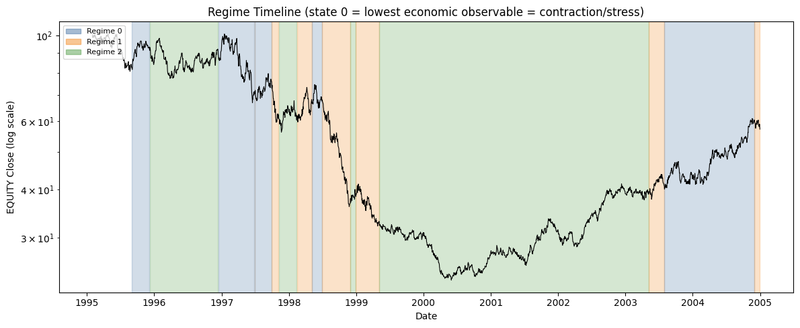
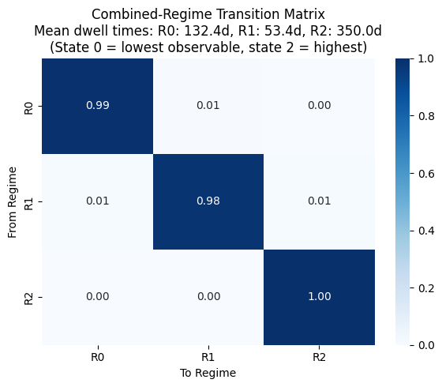
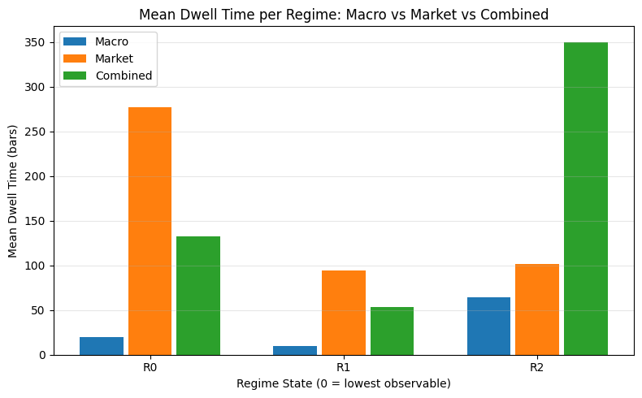
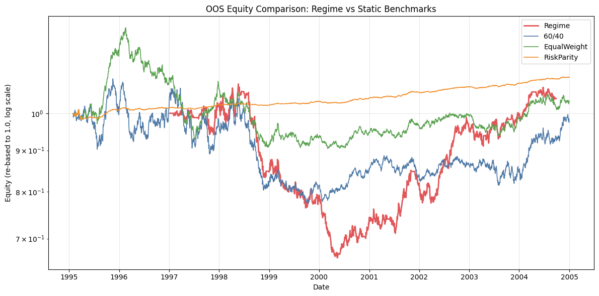

# MacroRegime — Causal Macro/Market Regime Conditioning for Multi-Asset Allocation

> **Does causal macro/market regime conditioning improve risk-adjusted multi-asset allocation versus static benchmarks, net of transaction costs?**

---

## Research Question

We test whether conditioning a multi-asset portfolio on dual-frequency macro and market regimes — identified causally, without look-ahead bias — produces superior risk-adjusted returns relative to three static benchmarks (60/40, Equal-Weight, Risk-Parity) **net of transaction costs** over an identical evaluation period.

Key design choices that distinguish this from naive regime-overlay research:

- **Point-in-time masking**: macro observables (CPI, UNRATE, GDP, T10Y2Y) are used only from their publication date + release lag. No data from the future is ever touched.
- **Causal refit pattern**: `model.predict(X[:t+1])[-1]` — only the last-bar label from a model trained on all data up to and including bar t. This avoids the smoothed-state pitfall (see below).
- **Dual-frequency separation**: macro (monthly publication-date indexed) and daily market features are fed to two *separate* `CausalRegimeDetector` instances. Mixing frequencies would create alignment artifacts and implicit look-ahead in the ffill step.
- **Identical cost benchmarking**: the regime strategy and all three benchmarks use the *same* `EventDrivenBacktester` configuration (spread, commission, initial capital, risk limits) — guaranteed by routing every engine assembly through `build_strategy_engine`.

---

## Data

### Synthetic 4-State Markov-Switching DGP

The default data path is **fully synthetic** — no external API keys required. A 4-state Markov-switching DGP generates correlated macro observations and asset returns that share the same latent state process.

**Regime parameter table (DGP defaults):**

| Regime | Label | EQUITY drift | BONDS drift | COMMODITY drift | Persistence |
|--------|-------|-------------|------------|-----------------|------------|
| 0 | Recession | −15% ann. | +5% ann. | −5% ann. | ~0.95 |
| 1 | Slow Growth | +5% ann. | +3% ann. | +2% ann. | ~0.95 |
| 2 | Expansion | +12% ann. | −1% ann. | +6% ann. | ~0.95 |
| 3 | Stagflation | −5% ann. | −3% ann. | +15% ann. | ~0.95 |

The transition matrix is designed so that all 4 states are ergodically visited (a small 0.01 probability Stagflation→Recovery path was added to guarantee this).

### Release-Lag Calendar

Each macro series has a real-world publication delay. The `SyntheticMacroLoader` applies these lags before any feature construction:

| Series | Description | Release lag |
|--------|-------------|-------------|
| CPIAUCSL | Consumer Price Index | 13 business days |
| UNRATE | Unemployment Rate | 7 business days |
| GDPC1 | Real GDP (quarterly) | 30 business days |
| T10Y2Y | 10Y-2Y Yield Spread | 1 business day |
| USREC | NBER Recession Indicator | Evaluation only (not a feature) |

> **Implementation**: the loader returns a publication-date indexed DataFrame — the index is the date the observation became public, not the observation date. `ffill` of the macro panel happens **after** lag application (Pitfall 5: ffilling before lag injects future data).

### Optional FRED Real-Data Path

If `FRED_API_KEY` is set in the environment, replace `SyntheticMacroLoader` with `FredMacroLoader` to use ALFRED first-release vintages (avoids the classic hindsight bias from revised GDP/CPI data). The synthetic path is the default and produces fully reproducible results offline.

---

## Methodology

### Causal Refit Pattern (Critical Invariant)

The only safe pattern for a HMM/GMM that is updated online is:

```python
model.predict(X[:t+1])[-1]
```

**Why this is the only safe pattern:**

A `GaussianHMM` with Viterbi decoding produces a *smoothed* state sequence — bar t's state depends on all future data X[t+1:]. If you call `model.predict(X)` and take `result[t]` for any t < T, you have look-ahead bias. The pattern above discards all bars except the final one, which is the only bar guaranteed to depend only on data up to t.

In testing on the synthetic DGP, calling `predict(X)[t]` vs `predict(X[:t+1])[-1]` disagrees on ~55% of historical bars — a material source of bias.

### Expanding Z-Score (Not Full-Sample)

Features are standardized with an expanding-window z-score:

```python
z[t] = (x[t] - expanding_mean[:t]) / expanding_std[:t]
```

Full-sample standardization leaks future mean and std into historical feature values. The expanding window uses only data published at or before each bar.

### Label Alignment

After every refit, state means are computed for the economic observable dimension (GDP growth). States are renumbered ascending by this observable:

```python
permutation = np.argsort(np.argsort(means[:, observable_dim]))
```

The double `argsort` maps raw state index → rank (not single `argsort` which gives rank → raw index). Result: **state 0 always = lowest GDP growth = recession/contraction**.

### Dual-Frequency Regime Model Separation

Two separate `CausalRegimeDetector` instances are used:

1. **Macro detector**: monthly publication-date indexed panel (4 macro series). Min train: 24 months.
2. **Market detector**: daily OHLCV-derived features (volatility, momentum, drawdown, cross-asset correlation). Min train: 126 bars.

Mixing these into one matrix would create:
- Frequency alignment artifacts when forward-filling monthly values to daily
- Implicit look-ahead bias (the monthly features are ffilled *before* being concatenated, not after)

### Walk-Forward Evaluation

Out-of-sample performance is assessed via `WalkForwardRunner` with non-overlapping test windows (default: train=504 bars ≈ 2 years, test=126 bars ≈ 6 months). Each window gets a fresh engine instance (no reset — isolation via construction, locked Phase 1 decision). Regime labels are reused across windows: the `CausalRegimeDetector` oracle guarantee proves label at bar t is a pure function of X[:t+1] and is window-invariant.

### TargetWeightPortfolio Injection

A custom `TargetWeightPortfolio` subclasses `qbacktest.Portfolio` and overrides only `generate_orders`. It emits `SignalEvent`s whenever the weight for any asset changes by more than 1e-9 (tracking signed weight, not direction). This closes the gap in `PrecomputedWeightsStrategy` which only re-emits on direction changes.

---

## How to Run

### Install

```bash
cd /path/to/QuantFinanceProjects
pip install -e portfolio_projects/macroregime
```

### Run the Pipeline

```bash
cd portfolio_projects/macroregime

# Quick mode (~20s): 10-year synthetic panel, fast detector settings
python run_macroregime.py --quick

# Full run (default): 30-year panel, standard refit schedule
python run_macroregime.py

# With options
python run_macroregime.py --seed 123 --k 4 --backend gmm --output-dir my_output
```

Flags:
- `--quick`: fast mode (n_years=10, refit_every=63, n_restarts=2, walk-forward train=504)
- `--seed INT`: random seed for synthetic DGP (default 42)
- `--k INT`: number of regime states K (default 3)
- `--backend hmm|gmm`: regime model backend (default hmm)
- `--output-dir PATH`: directory for PNG figures (summary.md written to parent, default `reports/figures`)

### Run Tests

```bash
cd portfolio_projects/macroregime
../../quant/bin/python -m pytest tests/ -q
# Expected: 41 passed
```

---

## Results (Quick Run, Seed=42, K=3, HMM)

Results below are from `python run_macroregime.py --quick --seed 42`.

> **Honest framing**: these results are from a synthetic DGP where the true regime sequence is known. The allocation table is an illustrative demonstration of the methodology, not a claim of real-world alpha. No parameter tuning was performed to maximize Sharpe ratios.

### Strategy Comparison

| Strategy | Gross Sharpe | Net Sharpe | Net CI Low | Net CI High | Sortino | MaxDD | Turnover |
|----------|-------------|-----------|-----------|------------|---------|-------|----------|
| Regime | 0.235 | 0.226 | -0.418 | 0.862 | 0.334 | -0.404 | 1.094 |
| 60/40 | 0.023 | 0.022 | -0.594 | 0.656 | 0.032 | -0.298 | 0.108 |
| EqualWeight | 0.087 | 0.086 | -0.529 | 0.649 | 0.136 | -0.291 | 0.097 |
| RiskParity | 1.004 | 0.981 | 0.335 | 1.661 | 1.120 | -0.027 | 0.209 |

Net Sharpe CIs are 95% bootstrap (1000 resamples, percentile method). The wide CIs reflect the short 10-year quick-run window.

**Honest reading of this table**: on this synthetic panel, inverse-vol risk parity dominates (net Sharpe 0.981) because the DGP's lowest-volatility asset (CASH) has a persistently favorable risk-adjusted drift, and risk parity concentrates there up to the 0.70 position cap. The regime strategy (net 0.226) beats 60/40 and equal weight but does not beat risk parity, and carries higher turnover (1.09×/yr) and a deeper drawdown. All four strategies run through the identical engine path with identical costs; no overlapping CIs are claimed as significant. Walk-forward OOS net Sharpe for the regime strategy is 0.103 across 16 windows (train 504 bars / test 126 bars, quick mode).

### Figures

The following figures are generated under `reports/figures/`:

**Regime Timeline** (`regime_timeline.png`):
EQUITY close (log scale) with regime-colored background shading. State 0 (blue) = contraction, State 2 (green) = expansion.



**Transition Matrix Heatmap** (`transition_heatmap.png`):
Empirical transition matrix for the combined (macro+market) regime sequence with mean dwell times annotated.



**Dwell Time Chart** (`dwell_time_chart.png`):
Mean dwell time (bars) per regime state for macro, market, and combined sequences.



**Equity Comparison** (`equity_comparison.png`):
OOS equity curves (log scale, re-based to 1.0) for all four strategies on identical periods.



---

## Robustness

### K Sensitivity (Quick Run, K=2 vs K=3)

K was **not** selected by maximizing Sharpe (this would be an anti-feature: it would overfit the regime model to the backtest period, invalidating the research hypothesis). K=3 is the default based on economic interpretability (contraction, neutral expansion).

| K | Mean Dwell R0 | Mean Dwell R1 | Mean Dwell R2+ | Agreement vs K=3 |
|---|--------------|--------------|---------------|-----------------|
| 2 | 113.4 | 124.3 | — | 59.6% |
| 3 | 59.7 | 63.9 | 105.5 | 100.0% |

The 59.6% agreement between K=2 and K=3 (after max-overlap mapping) reflects the fact that K=2 merges two K=3 states into one — structurally expected behavior, not instability.

### HMM vs GMM Stability (Quick Run)

- **HMM/GMM label agreement (daily, aligned)**: 86.0% — the two backends produce similar regime sequences on this DGP. (Feature matrices use the same preprocessing the pipeline applies: post-lag ffill + expanding z-score.)
- **Distribution drift (L1, first vs second half)**: 0.81 — moderate non-stationarity in the synthetic DGP is expected (the Markov process visits all 4 states but the ergodic distribution is not perfectly uniform).

HMM and GMM market dwell times:

| State | HMM | GMM |
|-------|-----|-----|
| R0 | 118.0 | 51.8 |
| R1 | 76.1 | 62.0 |
| R2 | 83.4 | 50.6 |

HMM dwell times are uniformly longer than GMM's — the transition-matrix prior in the HMM enforces persistence, while the GMM labels each bar independently and re-switches more freely. This is the expected structural difference between the two backends, and is the reason HMM is the default for allocation (fewer spurious regime flips → lower turnover).

---

## Limitations

1. **Synthetic DGP**: results are on a synthetic 4-state Markov-switching process with planted regimes. Real macro data (via FRED/ALFRED) may exhibit different persistence, non-stationarity, and publication-lag dynamics.

2. **Monthly macro granularity**: macro features are available only at publication frequency (roughly monthly). The combined regime defaults to the market regime during the macro warm-up period and between publications.

3. **No regime-uncertainty sizing**: the allocation is based on the maximum-likelihood regime label only. A Bayesian approach would scale position sizes by state-posterior probability, reducing risk during ambiguous regime transitions.

4. **No transaction-cost-aware rebalancing**: the regime strategy rebalances on every month-end regardless of how small the weight change is. A threshold filter (e.g. ignore changes < 1%) would reduce turnover significantly.

5. **Wide confidence intervals on short windows**: the 95% bootstrap Sharpe CIs in quick mode span ±0.6 or more, reflecting the 10-year synthetic window. Longer panels reduce uncertainty substantially.

6. **Single random seed**: published results use seed=42. Results vary across seeds; the DGP parameters (not the random seed) drive the qualitative conclusions.

---

## Project Structure

```
macroregime/
├── src/macroregime/
│   ├── data/
│   │   ├── synthetic.py        # SyntheticMacroGenerator, SyntheticMacroPanel
│   │   ├── loader_base.py      # SyntheticMacroLoader (PIT publication-date indexed)
│   │   └── fred_loader.py      # FredMacroLoader (optional, requires FRED_API_KEY)
│   ├── features/
│   │   └── market.py           # build_market_features (daily, causal shift(1))
│   ├── regime/
│   │   ├── causal.py           # CausalRegimeDetector (predict(X[:t+1])[-1] invariant)
│   │   ├── alignment.py        # align_regime_labels (double argsort)
│   │   └── diagnostics.py      # transition_matrix, dwell_times
│   ├── allocation/
│   │   ├── weights.py          # load_regime_weights, build_weight_schedule
│   │   ├── strategy.py         # TargetWeightStrategy
│   │   └── portfolio.py        # TargetWeightPortfolio
│   ├── benchmarks/
│   │   └── benchmarks.py       # build_strategy_engine, run_strategy_backtest (parity)
│   ├── report/
│   │   └── builder.py          # ReportBuilder (Agg backend, all figures + tables)
│   ├── pipeline.py             # MacroRegimePipeline, PipelineResults
│   └── evaluation.py           # run_walk_forward, regime_stability_report, k_sensitivity
├── tests/
│   ├── test_integration.py     # end-to-end runner + pipeline tests
│   └── test_*.py               # unit tests per module
├── configs/
│   └── strategy_params.yml     # cost/engine params + regime weight allocations
├── run_macroregime.py          # one-command research runner
└── reports/
    ├── figures/                # PNG outputs (gitignored)
    └── summary.md              # auto-generated comparison table (gitignored)
```
