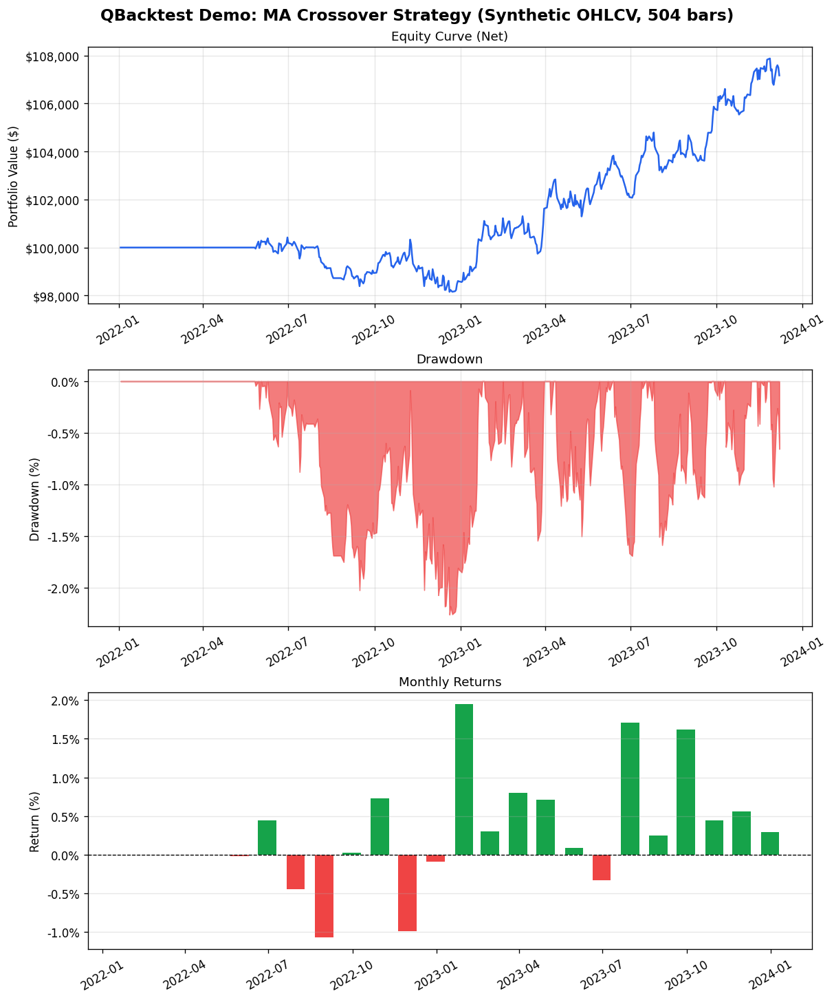

# QBacktest — Deterministic Event-Driven Backtesting Library

## What Is QBacktest?

**Research question:** Can we build a backtesting engine that is provably honest — preventing look-ahead bias through structural T+1 fill invariants, accounting invariants, and bootstrap Sharpe confidence intervals?

QBacktest is a Python backtesting library built around four correctness invariants:

1. **T+1 fill invariant:** Orders generated on bar T fill at bar T+1's open. The engine flushes pending orders *before* advancing the data cursor — structurally preventing same-bar fills.
2. **Accounting invariant:** `cash + book_value_of_positions == initial_capital + cumulative_PnL` holds after every fill.
3. **Walk-forward isolation:** Each walk-forward fold uses its own HistoricalDataHandler instance — no shared mutable state between train and test windows.
4. **Determinism:** Two runs with identical seed and configuration produce byte-identical equity curves.

The library is installable as a path dependency, making it reusable across projects 2–5 in this repository.

---

## Data Description

All demo runs use a synthetic OHLCV generator based on Geometric Brownian Motion (GBM):

- **Generator:** `SyntheticOHLCVGenerator` — seeded per-symbol (`seed + i * 1000`) for independent, reproducible price paths
- **Demo dataset:** 3 symbols (AAPL, MSFT, GOOG), 504 daily bars (~2 trading years), `seed=42`
- **Parameters:** `mu=0.0002` (daily drift), `sigma=0.015` (daily volatility), initial price 100.0
- **Purpose:** Offline testing without real market data; deterministic across machines

---

## Methodology

### Architecture: Event-Driven Engine

The engine uses a four-event pipeline per bar:

```
MarketEvent → SignalEvent → OrderEvent → FillEvent
```

**Loop order per bar:**
1. `_flush_pending_orders()` — fill buffered orders at T+1 open
2. `data_handler.update_bars()` — advance cursor, emit MarketEvents
3. Drain EventQueue: MARKET → signals + MTM; SIGNAL → orders; ORDER → buffer; FILL → accounting

### Four Invariants

| Invariant | Enforcement mechanism |
|-----------|----------------------|
| T+1 fill | `_flush_pending_orders()` runs *before* `update_bars()` |
| Accounting | `check_accounting_invariant()` verifiable after any run |
| Walk-forward isolation | Separate `HistoricalDataHandler` instances per fold |
| Determinism | Per-symbol seeded RNG; no global state mutation |

### Demo Strategy: MA Crossover

- **Fast SMA:** 20-bar window
- **Slow SMA:** 50-bar window
- **LONG** when fast crosses above slow; **EXIT** when fast crosses below slow
- Uses `HistoricalDataHandler.get_latest_bars()` — no look-ahead

### Cost Model

- Slippage: `FixedSlippage(bps=10)`
- Commission: `PercentageCommission(rate=0.001)` (10bps per trade)
- Gross equity reconstructed as `net_equity + cumulative_commission` at each bar

---

## Installation

```bash
pip3 install -e portfolio_projects/qbacktest
```

Or with explicit path from repo root:

```bash
pip3 install -e /path/to/QuantFinanceProjects/portfolio_projects/qbacktest
```

---

## How to Run

### One-command demo

```bash
cd portfolio_projects/qbacktest
python3 run_demo.py
```

This generates:
- `reports/figures/demo_tearsheet.png` — 3-panel tearsheet (equity curve, drawdown, monthly returns)
- stdout — gross/net summary table with bootstrap Sharpe 95% CI

### Run the test suite

```bash
cd portfolio_projects/qbacktest
python3 -m pytest tests/ -v
```

### Run a single test file

```bash
python3 -m pytest tests/test_tearsheet.py -v
python3 -m pytest tests/test_engine.py -v
```

---

## Results Summary

Demo run: MA Crossover (20/50 SMA), 3 symbols (AAPL/MSFT/GOOG), 504 bars, seed=42,
FixedSlippage(10bps) + PercentageCommission(0.1%):

```
====================================================
Demo Backtest Results — MA Crossover (20/50) SMA
====================================================
Metric                Gross           Net
------------------------------  ------------    ------------
Total Return          7.17%           7.17%
Sharpe                0.5957          0.5864
Sharpe 95% CI         n/a             [-0.20, 1.37]
Sortino               n/a             0.4714
Max Drawdown          n/a             -2.26%
Turnover (ann.)       n/a             0.1840
Hit Rate              n/a             66.67%
Cost (bps)            n/a             10.00
Trades                n/a             9
====================================================
```

Tearsheet PNG (3 panels — equity curve, drawdown, monthly returns):



---

## API Quickstart

```python
from qbacktest import (
    BacktestConfig,
    EventDrivenBacktester,
    HistoricalDataHandler,
    SyntheticOHLCVGenerator,
    TearsheetRenderer,
    Strategy,
)
from qbacktest.events import MarketEvent, SignalEvent
from qbacktest.execution import FixedSlippage, PercentageCommission
from qbacktest.execution.handler import SimulatedExecutionHandler


class MyStrategy(Strategy):
    def initialize(self, data_handler):
        self.data_handler = data_handler

    def calculate_signals(self, event: MarketEvent) -> list[SignalEvent]:
        # Your logic here
        return []


# Generate synthetic data
gen = SyntheticOHLCVGenerator(symbols=["AAPL"], n_bars=504, seed=42)
data = gen.generate()

# Run backtest
data_handler = HistoricalDataHandler(data)
strategy = MyStrategy()
config = BacktestConfig(initial_capital=100_000.0, position_size=0.1)
execution = SimulatedExecutionHandler(
    slippage_model=FixedSlippage(bps=10),
    commission_model=PercentageCommission(rate=0.001),
)
engine = EventDrivenBacktester(
    data_handler=data_handler,
    strategy=strategy,
    execution_handler=execution,
    config=config,
)
results = engine.run()

# Render tearsheet
renderer = TearsheetRenderer(output_dir="reports/figures")
path = renderer.render(results, title="My Strategy")
print(renderer.summary_table(results))
print(f"Net Sharpe: {results.net_sharpe:.4f}")
print(f"Gross Sharpe: {results.gross_sharpe:.4f}")
```
