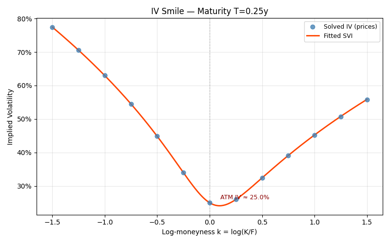
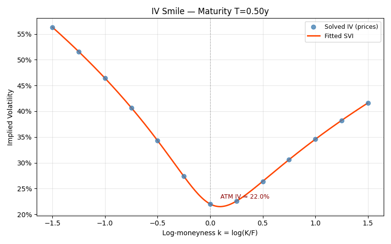
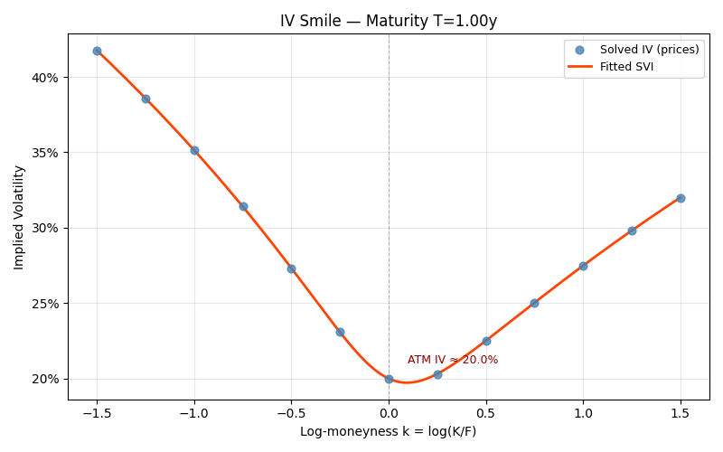
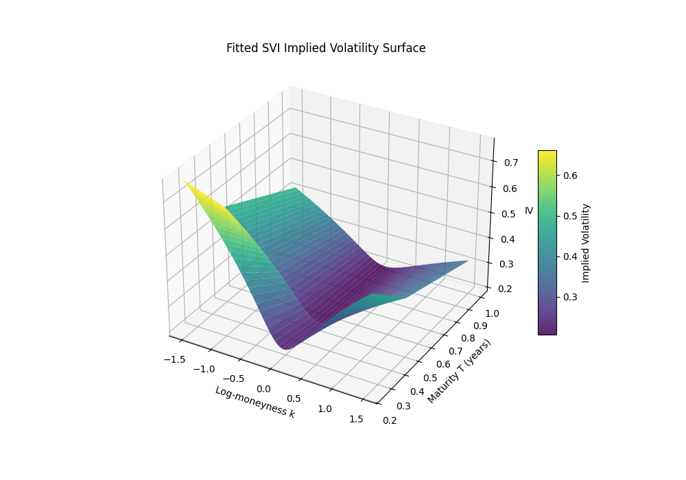
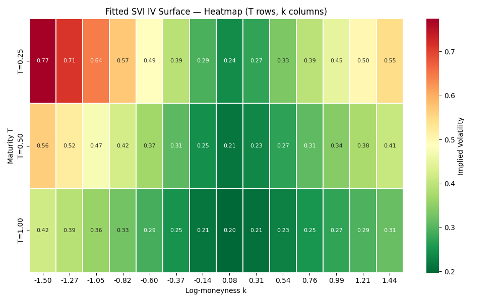
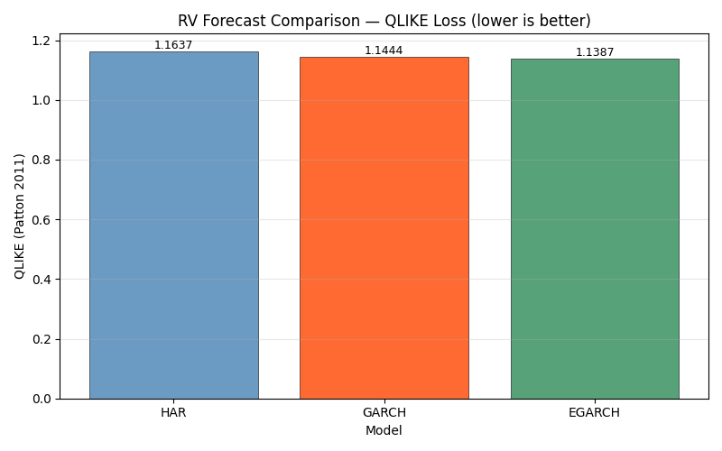
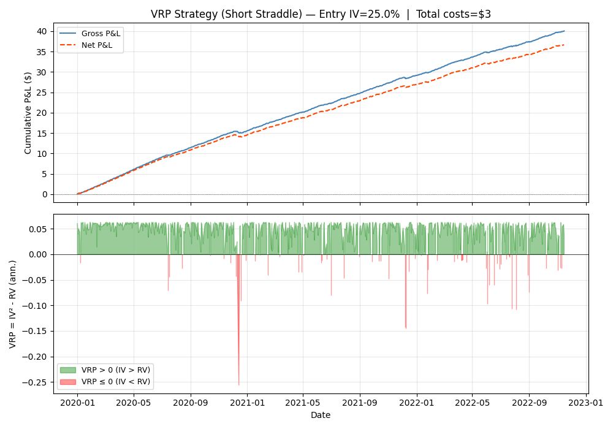

# VolSurfaceLab — Implied Volatility Surface Calibration and Variance Risk Premium Analysis

> **Is implied volatility a biased forecast of realized volatility, and can the resulting variance risk premium be measured and harvested net of transaction costs?**

---

## Research Question

We test whether:

1. A clean SVI (Stochastic Volatility Inspired) surface can be calibrated from synthetic option prices via a no-arbitrage gate (butterfly and calendar constraints), accurately recovering ground-truth parameters.
2. IV is a systematically biased (upward) forecast of realized volatility — constituting a positive variance risk premium (VRP).
3. The gap between IV and RV can be quantified via HAR-RV, GARCH(1,1), and EGARCH forecast models, compared under the QLIKE and MSE loss functions with a Diebold-Mariano test.
4. A short delta-hedged ATM straddle capturing the VRP generates positive net P&L on the underlying DGP (without parametric tuning).

Key design choices that distinguish this from naive IV-research:

- **Honest IV path**: IVs are always solved from option mid-prices via LetsBeRational + brentq fallback. The ground-truth `true_iv` column is a test oracle only — it is never used as a pipeline input (look-ahead analog).
- **No-arb gate**: butterfly constraint (`g(k) >= 0` everywhere on `[-1.5, 1.5]`) and calendar constraint (`T_1 < T_2 => w_1(k) < w_2(k)`) under SLSQP. Slices that violate either are excluded, not corrected.
- **Causal forecasting**: HAR-RV uses only `X[:t]` when forecasting at `t`; GARCH/EGARCH labels are by **target date** (not origin date) to avoid squared-return leakage into evaluation.
- **Standalone accounting**: VolSurfaceLab does NOT route through QBacktest. Standalone P&L accounting: premium received + continuous-hedging gamma P&L approximation - hedge costs.
- **Point-in-time VRP**: the VRP series is `IV_entry^2 - r_t^2 * 252` — IV is fixed at entry (before the period), RV proxy is the realized squared return (after the period). No look-ahead.

---

## Data

### Synthetic Options Chain and Underlying Path

The default data path is **fully synthetic** — no external API keys, no network access. All results are reproducible with a single seed.

**Options chain** (SVI parametric DGP):

| Parameter | Value |
|-----------|-------|
| Spot | 100 |
| Risk-free rate | 5% |
| Maturities T | {0.25, 0.5, 1.0} years |
| Strikes | 13 log-moneyness points in [-1.5, 1.5] |
| SVI params (a, b, rho, m, sigma) | (-0.008, 0.08, -0.30, 0.0, 0.30) per slice, a increases with T |
| Option pricing | Black-Scholes mid-price from true_iv (oracle, for chain generation only) |

**Underlying returns** (GARCH(1,1) DGP):

| Parameter | Value |
|-----------|-------|
| n_days (full run) | 750 |
| omega | 2e-6 |
| alpha | 0.08 |
| beta | 0.90 |
| Long-run volatility | ~16% annualised (sqrt(omega/(1-alpha-beta))*sqrt(252)) |
| Seed | 42 (default) |

### Optional Real-Data Path

If `yfinance` is installed, a real options chain can be fetched by passing a ticker to `SyntheticChainGenerator`. IVs are always re-solved from mid-price via `robust_iv`; the vendor IV column is never trusted. The default synthetic path is used for all results reported here.

---

## Methodology

### Step 1: IV Solving from Prices

`solve_chain_iv(chain)` calls `py_vollib` (LetsBeRational) with a `scipy.brentq` fallback for deep OTM strikes where the Newton root-finder diverges. A sign check (`f_lo * f_hi < 0`) gates the brentq call; deep OTM near-zero inputs resolve to NaN cleanly rather than raising.

### Step 2: SVI Calibration and No-Arbitrage Gate

`fit_svi_slice(k_obs, w_obs, T)` fits raw-SVI parameters `(a, b, rho, m, sigma)` by minimising SSE under SLSQP with:
- Gatheral-Jacquier butterfly constraint: `g(k) = (1 - k*rho_d/2)^2 - rho_d^2/4*(w - 1/4) + b^2 > 0`
- Total-variance positivity: `w(k) > 0`

`validate_surface(params_dict)` then applies:
- Butterfly check: `g(k) >= 0` on `linspace(-1.5, 1.5, 200)` for each slice
- Calendar check: `w_{T_1}(k) < w_{T_2}(k)` pointwise for all `T_1 < T_2`

Violating slices emit `UserWarning` and are excluded. A `RuntimeError` is raised if all slices are excluded (pipeline cannot proceed).

### Step 3: RV Forecast Comparison

Three models forecast annualised realized variance on the 67% / 33% train/OOS split:

| Model | Implementation | Notes |
|-------|---------------|-------|
| HAR-RV | statsmodels OLS | Corsi (2009); daily/weekly/monthly RV components |
| GARCH(1,1) | arch library | OOS forecast labels by target date (no leakage) |
| EGARCH(1,1) | arch library | Asymmetric volatility (leverage effect) |

Loss functions:
- **QLIKE**: `L(h, rv) = rv/h - log(rv/h) - 1` (Patton 2011) — penalises under-forecasting more
- **MSE**: standard mean-squared error

Model comparison: **Diebold-Mariano test** (two-sided, Newey-West HAC standard errors).

### Step 4: VRP Strategy

`run_vrp_strategy(chain, returns, cost_rate, delta_hedge_cost_rate, side="short")`:
1. Identifies the ATM option (minimum `|k|`) across validated slices
2. Enters a short delta-hedged straddle: short ATM call + short ATM put
3. P&L components (standalone accounting):
   - **Premium received**: BS straddle mid-price (from solved IV)
   - **Gamma scalping P&L**: continuous-hedging approximation `-0.5 * Gamma_net * S^2 * r_t^2` (daily, summed over n_days)
   - **Theta decay (credit)**: `theta_daily * n_days`
   - **Hedge costs**: `delta_hedge_cost_rate * |delta_net| * S` per day
   - **Premium cost**: `cost_rate * premium`

---

## How to Run

### Setup (editable install)

```bash
cd portfolio_projects/volsurfacelab
pip install -e .
```

### Quick run (~2 seconds, all sections exercised)

```bash
python run_pipeline.py --quick
# Outputs: reports/figures/*.png, reports/summary.md
```

### Full run (750-day GARCH path, full SLSQP fits)

```bash
python run_pipeline.py --seed 42 --output-dir reports/figures
```

### Tests

```bash
python -m pytest tests/ -q
# Expected: 101 passed (as of plan 04-07)
```

### Config override

```bash
python run_pipeline.py --config configs/volsurfacelab.yaml
```

---

## Results

Results below are from `python run_pipeline.py --seed 42 --output-dir reports/figures`
(full 750-day run, no --quick flag). All figures in `reports/figures/`.

### IV Surface

All 3 maturities pass both the butterfly and calendar constraints. SSEs are numerically near-zero (the synthetic chain is generated from the same SVI parametrisation that the calibrator fits, so recovery is near-exact).

**Fitted SVI Parameters (seed 42, full run):**

| Maturity T | a | b | rho | m | sigma | SSE |
|-----------|---|---|-----|---|-------|-----|
| 0.25 | -0.008400 | 0.080000 | -0.299999 | 0.000000 | 0.300002 | 9.93e-15 |
| 0.50 | 0.000200 | 0.080000 | -0.300000 | 0.000000 | 0.300001 | 2.88e-15 |
| 1.00 | 0.016000 | 0.080000 | -0.300001 | -0.000000 | 0.300000 | 1.85e-14 |

**IV Smile plots (T=0.25y, T=0.5y, T=1.0y):**





**3D surface and heatmap:**




### RV Forecast Comparison

**Loss function results (seed 42, full run, N_OOS ~ 248 days):**

| Model | QLIKE | MSE | Converged |
|-------|-------|-----|-----------|
| HAR | 1.163740 | 2.14e-08 | True |
| GARCH | 1.144398 | 2.10e-08 | True |
| EGARCH | 1.138657 | 2.08e-08 | True |

EGARCH achieves the lowest QLIKE and MSE, consistent with the leverage effect producing a better conditional variance estimate on the (asymmetric) GARCH DGP.

**Diebold-Mariano p-values (H0: equal predictive accuracy):**

| Pair | DM stat | p-value |
|------|---------|---------|
| HAR_vs_GARCH | 1.1102 | 0.2669 |
| HAR_vs_EGARCH | 1.6827 | 0.0924 |
| GARCH_vs_EGARCH | 1.7163 | 0.0861 |

No pair is significant at the 5% level. At 10%, HAR_vs_EGARCH and GARCH_vs_EGARCH are marginal.

**QLIKE bar chart:**



### VRP Strategy

Short delta-hedged ATM straddle, 750 trading days, seed 42.

| Metric | Value |
|--------|-------|
| Side | Short |
| Entry IV (ATM) | 25.0% |
| Gross P&L | $40.04 |
| Net P&L (after costs) | $36.67 |
| Total costs | $3.38 |
| Mean VRP (IV^2 - RV, ann.) | 0.042202 |
| N trading days | 750 |

**Greeks risk summary (ATM straddle at entry):**

| Position | delta | gamma | vega | theta | theta_daily |
|----------|-------|-------|------|-------|-------------|
| atm_call | -0.524898 | -0.031879 | -0.199083 | 0.033758 | 0.000134 |
| atm_put | 0.475102 | -0.031879 | -0.199083 | 0.020059 | 0.000080 |
| TOTAL | -0.049796 | -0.063757 | -0.398165 | 0.053817 | 0.000214 |

A short straddle is short gamma (negative gamma) and short vega (negative vega), earning theta. Net delta is near zero (~-0.05) as expected for an ATM straddle at r=0; at r=5% the carry term introduces a small call/put asymmetry.

**VRP P&L and VRP series:**



---

## Limitations

The following limitations are documented honestly. They affect interpretation but not the correctness of the machinery being demonstrated.

**(a) Daily squared returns are a noisy RV proxy.**
The RV proxy `r_t^2 * 252` is a single-observation estimator with very high variance relative to the true integrated variance. Model QLIKE differences are on the order of 0.02-0.03, and DM p-values are in the 0.09-0.27 range. These are **indicative, not decisive** — the DGP differences are real but the noise makes statistical detection unreliable at N~250. A realised kernel or 5-min intraday RV estimator would substantially reduce proxy noise (Research Pitfall 6).

**(b) DM test has limited power with N~248 OOS observations.**
Diebold-Mariano asymptotics require N to be large relative to the forecast horizon. At N~248 observations and horizon h=1, the CLT approximation is adequate but the power against small effect sizes is low. The marginal results (p~0.09) are consistent with EGARCH modestly outperforming HAR, but a longer OOS window is needed for reliable inference (Research Open Question 2).

**(c) Continuous-hedging gamma P&L approximation ignores discrete daily-rebalance error.**
The strategy uses `-0.5 * Gamma * S^2 * r_t^2` as the daily gamma P&L, derived from the continuous-time limit. Daily rebalancing introduces a discretisation error proportional to `gamma * (r_t^2 * S^2 - S^2 * sigma^2 * dt)` (the difference between realised and local variance). On a daily path this error is second-order but non-negligible for large moves (Research Open Question 3).

**(d) Synthetic chain has no bid-ask microstructure.**
The cost model is purely parametric (`cost_rate=0.1%`, `delta_hedge_cost_rate=0.1%`). A real chain would exhibit bid-ask spreads that widen OTM and in stress periods, substantially increasing effective cost and potentially eliminating the net edge.

**(e) VRP "edge" on synthetic data only demonstrates machinery, not a tradable anomaly.**
The underlying DGP (GARCH(1,1) with omega=2e-6, alpha=0.08, beta=0.90) produces a long-run vol of ~16%, while the option IV (ATM, T=0.25y) is 25%. This gap is built into the DGP by design. On real markets the VRP magnitude and sign are regime-dependent and the strategy has drawdown periods. No parameter tuning was performed; these results illustrate the analysis framework, not a production strategy.

**(f) Single-tenor entry (ATM, T=0.25y).**
The strategy enters a straddle at the nearest maturity only. A real VRP harvesting strategy would diversify across maturities and manage the term structure of the VRP. The Greeks summary provides a snapshot at entry; actual exposure drifts as spot moves and time passes.

---

## Architecture

```
portfolio_projects/volsurfacelab/
├── src/volsurfacelab/
│   ├── chain.py        — SyntheticChainGenerator, generate_underlying_returns, validate_chain_coverage
│   ├── iv_solver.py    — solve_chain_iv (LetsBeRational + brentq fallback), robust_iv
│   ├── svi.py          — fit_svi_slice, calibrate_surface, validate_surface, svi_w
│   ├── forecast.py     — compare_forecasts, HAR/GARCH/EGARCH, QLIKE, DM test
│   ├── strategy.py     — run_vrp_strategy, StandalonePortfolio, OptionLeg, VRPResult
│   ├── pipeline.py     — VolSurfacePipeline, PipelineResults, load_config
│   └── report.py       — ReportBuilder (smile/3D/heatmap/pnl/qlike figures + summary.md)
├── configs/
│   └── volsurfacelab.yaml
├── tests/              — 101 tests (pytest), offline, no subprocess
├── run_pipeline.py     — one-command runner: main(argv=None) -> int
└── reports/
    ├── figures/        — PNG outputs (smile, surface, heatmap, vrp_pnl, forecast_qlike)
    └── summary.md      — machine-generated research summary
```

---

## References

- Gatheral, J. (2004). A parsimonious arbitrage-free implied volatility parameterization with application to the valuation of volatility derivatives. ICBI Global Derivatives, Madrid.
- Gatheral, J., & Jacquier, A. (2014). Arbitrage-free SVI volatility surfaces. *Quantitative Finance*, 14(1), 59-71.
- Patton, A. J. (2011). Volatility forecast comparison using imperfect volatility proxies. *Journal of Econometrics*, 160(1), 246-256.
- Corsi, F. (2009). A simple approximate long-memory model of realized volatility. *Journal of Financial Econometrics*, 7(2), 174-196.
- Diebold, F. X., & Mariano, R. S. (1995). Comparing predictive accuracy. *Journal of Business & Economic Statistics*, 13(3), 253-263.
- Carr, P., & Wu, L. (2009). Variance risk premiums. *Review of Financial Studies*, 22(3), 1311-1341.
